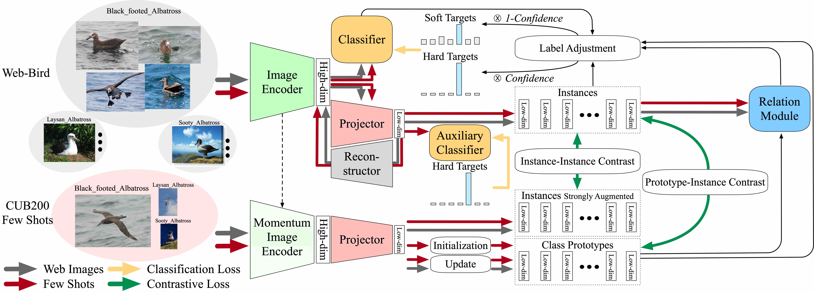

# FoPro: Few-Shot Guided Robust Webly-Supervised Prototypical Learning

# Abstract
Recently, webly supervised learning (WSL) has been studied to leverage numerous and accessible data from the Internet. Most existing methods focus on learning noise-robust models from web images while neglecting the performance drop caused by the differences between web domain and real-world domain. However, only by tackling the performance gap above can we fully exploit the practical value of web datasets. To this end, we propose a Few-shot guided Prototypical (FoPro) representation learning method, which only needs a few labeled examples from reality and can significantly improve the performance in the real-world domain. Specifically, we initialize each class center with few-shot real-world data as the "realistic" prototype. Then, the intra-class distance between web instances and "realistic" prototypes is narrowed by contrastive learning. Finally, we measure image-prototype distance with a learnable metric. Prototypes are polished by adjacent high-quality web images and involved in removing distant out-of-distribution samples. In experiments, FoPro is trained on web datasets with a few real-world examples guided and evaluated on real-world datasets. Our method achieves the state-of-the-art performance on three fine-grained datasets and two large-scale datasets. Compared with existing WSL methods under the same few-shot settings, FoPro still excels in real-world generalization.

# Overview
 The t-SNE visualization of the low-dimensional embeddings of web images. (b) The diminished performance gap between the testing results of web (WebVision1k) and real-world (ImageNet1k). (c) Better interpretability, discriminability, and generalization of cluster prototypes.")



# Dataset Download
In experiments, we use three fine-grained web datasets from WebFG496 and two large-scale web datasets from WebVision1k.
## WebFG496
The download link can be refered in <https://github.com/NUST-Machine-Intelligence-Laboratory/weblyFG-dataset>.
Download the dataset into ```./dataset/WebFG496```.

## WebVision1k (WebVision 1.0)
The download link can be refered in <https://data.vision.ee.ethz.ch/cvl/webvision/download.html>. We used the downsampled (256 * 256) version for convenience.

## Google500
The Google500 dataset uses the randomly sampled 500 classes from the 1000 classes in WebVision1k with images only sourced from Google. The detailed description of Google500 can be refered in <https://github.com/bigvideoresearch/SCC>.

## Real-world Testing Sets
In experiments, we evaluate webly-supervised models on the real-world testing sets including:
* CUB200-2011 <https://www.vision.caltech.edu/datasets/cub_200_2011/>
  * Download the dataset into ```./dataset/FGVC/CUB_200```. 
* FGVC-Aircraft <https://www.robots.ox.ac.uk/~vgg/data/fgvc-aircraft/>
  * Download the dataset into ```./dataset/FGVC/aircraft```.
* Stanford Cars <http://ai.stanford.edu/~jkrause/cars/car_dataset.html>
  * Download the dataset into ```./dataset/FGVC/stanford_cars```.
* ImageNet 1k <https://image-net.org/download.php>
  * Download the dataset into ```./dataset/webvision1k/imagenet```.


# Data Preparation
## WebFG496
Please download the datasets above and put the corresponding folders inside the ```./dataset/WebFG496```.

## Fine-Grained Testing Sets
Please download the datasets above and put the corresponding folders inside the ```./dataset/FGVC```.

## WebVision1k
Please download the datasets above and put the corresponding folders inside the ```./dataset/webvision1k/resized_images```.

## ImageNet1k
Please download the datasets above and put the corresponding folders inside the ```./dataset/webvision1k/imagenet```.

## TF-Record
In experiments of WebVision1k/Google500, we use tfrecord format so that the I/O speed could be improved for training/evaluation.

Please check the ```./tfrecord/encode_tfrecord.py``` and fill in the root path of WebVision1k and ImageNet1k.

Please make sure the path is correct.

## WebVision1k/ImageNet1k & Google500/ImageNet1k filelist
The filelist can be referred in SCC <https://github.com/bigvideoresearch/SCC>.

For compatibility, we keep all image filelist in ```./dataset/webvision1k/filelist```.
* Text files that end with "_tf.txt" refer to the format in TF-Record.
* Text files that just end with ".txt" refer to the format in ".jpg" or ".jpeg".

## Pretrained Weights
### BCNN (VGG16)
For experiments on fine-grained datasets, please use the ```--pretrained``` flag to load the pretrained weights of pytorch torchvision models.

### ResNet50
For experiments on large-scale datasets, please use the MoPro pretrained weights by downloading it from MoPro <https://github.com/salesforce/MoPro> and put the checkpoint weights as ```./ckpt_mopro/MoPro_V1_epoch90.tar```.

# Training
All the scripts can be found in ```./shells```.
## Few-Shot
Please replace the ```$pathlist_t``` with the corresponding path to the K-shot pathlist.
## Zero-Shot (Only Trained with Web Images)
Please remove the flag ```--use_fewshot``` in the script.

For example,
* use the script ```./shells/web-aircraft.sh``` for the training of BCNN models on web-aircraft.
* use the script ```./shells/webvision1k.sh``` for the training of ResNet models on WebVision1k.

# Evaluation

## Demo
All the scripts can be found in ```./eval_shells```.

For example,
* use the script ```./eval_shells/web-aircraft.sh``` for the evaluation of BCNN models on FGVC-Aircraft.
* use the script ```./eval_shells/webvision1k.sh``` for the evaluation of ResNet50 models on ImageNet1k.

## Model Weights


# Post-Processing
Enlightened by MoPro <https://openreview.net/forum?id=0-EYBhgw80y>, noise cleaning on the WebVision1k dataset can be performed to further reduce the noise and improve performance by fine-tuning.
For example,
* use the script ```./shells/webvision1k_ft.sh``` for noise cleaning and fine-tuning on WebVision1k with Mix-Up <https://arxiv.org/abs/1710.09412> strategy.

# Hyper-parameters Tuning
All the hyper-parameters are defined in ```./config_train.py```.

Preliminary experiments show that the $\beta=0.5=1-\alpha$ and $\gamma=0.6$ perform better than $\beta=0, 0.25, 0.75, 1$ and $\gamma=0.2$ on three fine-grained datasets (webFG496).

Other hyper-parameters are yet to be fine-tuned. Their current value is empirically set.

It remains to be explored which value of the distance threshold ```dist_th``` works best on picking out clean examples. One could design a threshold whose value varies with respect to epoch or loss.


# Acknowledgement
We would like to thank authors of SCC <https://arxiv.org/abs/2008.11894> for their instruction on reproduction of SCC results on WebVision1k/Google500.


# Citation
If you find this useful in your research, please consider citation of our work <https://arxiv.org/abs/2212.00465>:
```
@article{FoPro,
	title={FoPro: Few-Shot Guided Robust Webly-Supervised Prototypical Learning},
	author={Yulei Qin, Xingyu Chen, Chao Chen, Yunhang Shen, Bo Ren, Yun Gu, Jie
  Yang, Chunhua Shen},
	journal={AAAI},
	year={2023}
}
```

